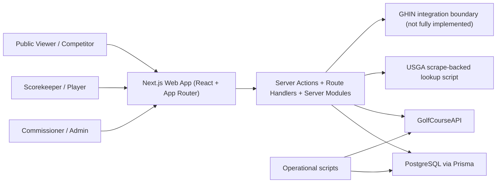

# ARCHITECTURE

## 1. PROJECT STRUCTURE

This tree reflects the checked-in source repository. Generated/runtime folders such as `node_modules/`, `.next/`, and local `.git/` metadata are intentionally omitted.

```text
fairway-match/
├── .env
├── .env.example
├── .env.local
├── .gitignore
├── ARCHITECTURE.md
├── README.md
├── app/                                      # Next.js App Router entrypoints
│   ├── admin/
│   │   ├── actions.ts
│   │   └── page.tsx
│   ├── api/                                  # Route handlers / JSON APIs
│   │   ├── admin/
│   │   │   └── tournament/
│   │   │       └── bootstrap/
│   │   │           └── route.ts
│   │   ├── courses/
│   │   │   └── search/
│   │   │       └── route.ts
│   │   ├── matches/
│   │   │   └── [token]/
│   │   │       └── scorecard/
│   │   │           └── route.ts
│   │   └── public/
│   │       └── tournament/
│   │           └── [slug]/
│   │               ├── bracket/
│   │               │   └── route.ts
│   │               └── standings/
│   │                   └── route.ts
│   ├── globals.css
│   ├── invite/
│   │   └── [token]/
│   │       └── page.tsx
│   ├── layout.tsx
│   ├── match/
│   │   └── [token]/
│   │       ├── page.tsx
│   │       ├── scorecard/
│   │       │   └── page.tsx
│   │       └── setup/
│   │           └── page.tsx
│   ├── not-found.tsx
│   ├── page.tsx
│   └── tournament/
│       └── [slug]/
│           ├── bracket/
│           │   └── page.tsx
│           ├── matches/
│           │   └── [matchId]/
│           │       └── page.tsx
│           ├── page.tsx
│           └── standings/
│               └── page.tsx
├── docs/                                     # Product and readiness docs
│   ├── foundation.md
│   ├── integration-strategy.md
│   ├── mvp-readiness-checklist.md
│   └── tournament-rules.md
├── eslint.config.mjs
├── next-env.d.ts
├── next.config.ts
├── package-lock.json
├── package.json
├── postcss.config.js
├── prisma/                                   # Database schema and seed data
│   ├── schema.prisma
│   └── seed.ts
├── public/                                   # Static assets
│   └── two-man-logo.png
├── scripts/                                  # One-off operational scripts
│   ├── import_2026_field.ts
│   ├── import_illinois_courses.ts
│   ├── reset_tournament_state.ts
│   └── stage_bracket_preview.ts
├── src/
│   ├── components/                           # UI building blocks and screens
│   │   ├── activity-feed.tsx
│   │   ├── bracket-view.tsx
│   │   ├── copy-button.tsx
│   │   ├── form-submit-button.tsx
│   │   ├── private-match-workspace.tsx
│   │   ├── public-nav.tsx
│   │   ├── section-card.tsx
│   │   ├── standings-table.tsx
│   │   ├── tournament-home-view.tsx
│   │   └── two-man-logo.tsx
│   ├── lib/
│   │   ├── api/                              # URL builders and shared route constants
│   │   │   └── routes.ts
│   │   ├── content/                          # In-app tournament rules content
│   │   │   └── tournament-rules.ts
│   │   ├── demo/                             # Demo/bootstrap fixtures
│   │   │   └── mock-data.ts
│   │   ├── providers/                        # External provider abstractions/adapters
│   │   │   ├── golf-course-api-provider.ts
│   │   │   ├── types.ts
│   │   │   └── usga-scrape-provider.ts
│   │   ├── scoring/                          # Pure golf rules engine
│   │   │   ├── engine.ts
│   │   │   └── types.ts
│   │   └── server/                           # DB-backed server orchestration
│   │       ├── admin-auth.ts
│   │       ├── admin-import.ts
│   │       ├── admin-validation.ts
│   │       ├── admin.ts
│   │       ├── bracket-sync.ts
│   │       ├── bracket.ts
│   │       ├── course-catalog.ts
│   │       ├── db.ts
│   │       ├── formatting.ts
│   │       ├── invitations.ts
│   │       ├── matches.ts
│   │       ├── public-tournament.ts
│   │       ├── qualification.ts
│   │       └── standings.ts
│   └── types/
│       └── models.ts
├── tailwind.config.ts
├── tests/                                    # Vitest suites
│   ├── admin-import.test.ts
│   ├── bracket-sync.test.ts
│   ├── bracket.test.ts
│   ├── qualification.test.ts
│   ├── scoring-engine.test.ts
│   ├── standings.test.ts
│   └── tournament-progression.test.ts
├── tsconfig.json
└── vitest.config.ts
```

Architectural grouping:
- `app/`: delivery layer, route surfaces, route handlers, page composition.
- `src/components/`: presentation layer.
- `src/lib/scoring/`: pure domain logic and deterministic scoring rules.
- `src/lib/server/`: application/service layer coordinating persistence and business workflows.
- `src/lib/providers/`: external system adapters behind stable interfaces.
- `prisma/`: persistence schema and seed/bootstrap state.
- `scripts/`: operator tooling for imports, resets, and staged previews.
- `tests/`: architecture-level regression protection for scoring, standings, qualification, and bracket progression.

## 2. HIGH-LEVEL SYSTEM DIAGRAM



Text-based view:
- Users interact with a single web application.
- Next.js serves both public pages and private/admin flows.
- Server actions and route handlers delegate to server-only modules in `src/lib/server`.
- Persistent state lives in PostgreSQL and is accessed only through Prisma.
- Course lookup can call GolfCourseAPI or a local USGA scrape-backed provider.
- Handicap sync is architected behind a provider boundary, but not fully production-wired yet.

## 3. CORE COMPONENTS

### Frontend Web Application
- Purpose: public tournament viewing, private score entry, and commissioner operations.
- Technologies: Next.js 15 App Router, React 19, TypeScript, Tailwind CSS.
- Deployment method: Node-hosted Next.js app using `next build` + `next start`.

Key frontend surfaces:
- Public home/feed: `app/page.tsx`, `src/components/tournament-home-view.tsx`
- Public standings/playoff picture: `app/tournament/[slug]/standings/page.tsx`
- Public bracket: `app/tournament/[slug]/bracket/page.tsx`, `src/components/bracket-view.tsx`
- Public match center: `app/tournament/[slug]/matches/[matchId]/page.tsx`
- Private match setup and live scorecard: `app/match/[token]/setup/page.tsx`, `app/match/[token]/scorecard/page.tsx`, `src/components/private-match-workspace.tsx`
- Admin/commissioner desk: `app/admin/page.tsx`

### Backend Application Layer
- Purpose: orchestrate reads/writes, enforce tournament rules, compute derived views, and expose JSON/HTML endpoints.
- Technologies: Next.js server components, route handlers, server actions, TypeScript, Prisma Client.
- Deployment method: same Next.js server process as the frontend; no separate backend service is present.

Representative backend modules:
- `src/lib/server/matches.ts`: private match read model and scorecard state hydration.
- `src/lib/server/public-tournament.ts`: public feed, standings, match shell, and bracket read model assembly.
- `src/lib/server/standings.ts`: pod standings and tie-break ranking.
- `src/lib/server/qualification.ts`: playoff qualification and seeding.
- `src/lib/server/bracket-sync.ts`: bracket advancement, reset, and progression synchronization.
- `src/lib/server/admin.ts`: commissioner-facing aggregate queries.
- `src/lib/server/admin-auth.ts`: password-session protection for `/admin`.

### Domain Scoring Engine
- Purpose: convert Handicap Index to course/playing handicap, allocate strokes, compute gross/net better-ball, hole points, and match outcomes.
- Technologies: pure TypeScript functions with Vitest coverage.
- Deployment method: bundled into the Next.js server process; no network calls required.

Primary file:
- `src/lib/scoring/engine.ts`

### Provider Adapters
- Purpose: isolate external course and handicap data dependencies from the core app.
- Technologies: server-only TypeScript adapters plus one local Python script invocation for USGA scraping.
- Deployment method: called from server modules and route handlers on demand.

Implemented/declared adapters:
- `src/lib/providers/golf-course-api-provider.ts`
- `src/lib/providers/usga-scrape-provider.ts`
- `src/lib/providers/types.ts`

### Operational Scripts
- Purpose: bootstrap data, stage preview states, import courses, and reset tournament state.
- Technologies: TSX/Node scripts.
- Deployment method: manually executed by operators from the CLI.

Examples:
- `scripts/import_2026_field.ts`
- `scripts/stage_bracket_preview.ts`
- `scripts/reset_tournament_state.ts`

## 4. DATA STORES

### PostgreSQL (primary transactional store)
- Type: PostgreSQL
- Access method: Prisma ORM (`prisma/schema.prisma`, `src/lib/server/db.ts`)
- Purpose: canonical state for tournament setup, scorecards, standings inputs, bracket structure, audit trail, and cached provider data.

Key schemas/tables:
- `Tournament`: tournament metadata, season window, rules, status.
- `Player`: participant identity, optional GHIN number, optional stored handicap metadata.
- `Team`, `TeamPlayer`: two-man team composition and roster positions.
- `Pod`, `PodTeam`: pod-play grouping and slot assignments.
- `Match`: pod-play and playoff matches, status, private/public identifiers, advancement links.
- `MatchPlayer`: per-match snapshot of tee selection, handicap index, course handicap, playing handicap, and strokes-by-hole.
- `HoleScore`: hole-by-hole gross scores.
- `Bracket`, `BracketRound`: knockout structure and round ordering.
- `MatchAuditLog`: commissioner corrections, reopen/reset history.
- `ActivityFeedEvent`: persisted public timeline events.
- `Course`, `CourseTee`, `CourseHole`: normalized course catalog with tee metadata and hole rows.
- `CourseLookupCache`: cached provider responses for course lookup queries.
- `ExternalSyncLog`: sync request/response/error audit for external integrations.
- `MatchInvitation`: tokenized invitation records for private match access workflows.

### Cache / Message Queue / Object Storage
- Redis: not present.
- Message queue: not present.
- Blob/object storage (e.g. S3): not present.
- CDN-specific asset store: not configured in repository.

Current caching approach:
- Provider lookup caching is persisted in PostgreSQL via `CourseLookupCache`.
- In-process Prisma singleton reuse is used during development to avoid excess client instantiation.

## 5. EXTERNAL INTEGRATIONS

### GolfCourseAPI
- Purpose: primary live course search and tee/hole metadata provider.
- Integration method:
  - HTTP `fetch` from the server
  - API key via `Authorization: Key ...`
  - adapter file: `src/lib/providers/golf-course-api-provider.ts`
- Used for:
  - course discovery
  - tee/rating/slope/par data
  - hole-level par / handicap / yardage when available

### USGA scrape-backed lookup script
- Purpose: fallback/alternate course directory lookup path.
- Integration method:
  - server-side `execFile("python3", ...)`
  - local script path referenced by `USGA_LOOKUP_SCRIPT`
  - adapter file: `src/lib/providers/usga-scrape-provider.ts`
- Notes:
  - this is environment-dependent
  - it is intentionally isolated behind provider interfaces

### GHIN integration boundary
- Purpose: eventual automated Handicap Index lookup.
- Integration method:
  - interface defined in `src/lib/providers/types.ts`
  - placeholder provider currently throws in `src/lib/providers/usga-scrape-provider.ts`
  - `ghin` npm package exists as an experimental dependency, but the repo does not yet ship a working production sync path
- Current state:
  - not operational
  - manual per-match handicap entry remains the active workflow

### Browser/platform integrations
- Cookies: admin session cookie under `/admin`
- Clipboard: copy buttons for links/actions in the browser UI
- No push notification, email provider, SMS provider, payment gateway, or analytics service is wired in the codebase today.

## 6. DEPLOYMENT & INFRASTRUCTURE

### Runtime model
- Primary runtime: single Next.js application server.
- Local commands:
  - `npm run dev`
  - `npm run build`
  - `npm run start`
- Build output style: standard Next.js production build.

### Cloud provider / managed services
- Cloud provider: not specified in repository.
- Compute platform: not specified in repository.
- Container/Kubernetes manifests: not present.
- Terraform/Pulumi/CloudFormation: not present.
- Reverse proxy/load balancer configuration: not present.

### Database infrastructure
- Required service: PostgreSQL reachable through `DATABASE_URL`.
- Provisioning automation for PostgreSQL is not included in the repo.

### CI/CD pipeline
- CI/CD workflow definitions are not present in the repository.
- No GitHub Actions, CircleCI, Buildkite, or similar pipeline config is currently checked in.

### Monitoring / observability
- Application monitoring tools are not configured in the repo.
- Logging is minimal:
  - Prisma logs warnings/errors in development and errors in production (`src/lib/server/db.ts`)
- No Sentry, Datadog, OpenTelemetry, or structured log pipeline is configured.

## 7. SECURITY CONSIDERATIONS

### Authentication
- Admin authentication:
  - password-based session for `/admin`
  - implementation in `src/lib/server/admin-auth.ts`
  - uses HMAC-signed cookie payloads
  - 12-hour session TTL
- Match scorer access:
  - tokenized private match URLs via `Match.privateToken`
  - invitation tokens via `MatchInvitation.token`
- Public viewer access:
  - anonymous read-only access to public tournament routes

### Authorization model
- `/admin` routes and admin server actions require a valid admin session.
- Private scorecard mutation routes are gated by possession of the private match token.
- Public tournament routes do not allow writes.
- No role-based multi-user authorization model exists yet beyond admin vs token holder vs public viewer.

### Data protection
- Cookie settings:
  - `httpOnly`
  - `sameSite: "lax"`
  - `secure` in production
- Password and session validation use constant-time comparison primitives where possible (`timingSafeEqual`).
- Transport encryption:
  - expected to be provided by HTTPS/TLS in deployed environments
  - not configured directly in this repo
- Encryption at rest:
  - depends on the PostgreSQL hosting platform
  - not configured directly in this repo

### Security-related gaps / watch items
- Admin auth is password-only; no MFA or identity provider.
- Private scorecard access is bearer-by-URL; URLs should be treated as secrets.
- No audit viewer UI yet for all match changes, even though `MatchAuditLog` exists.
- No rate limiting, WAF, or abuse-protection layer is defined in the repo.
- Secrets are env-driven; secret management platform is not documented here.

## 8. DEVELOPMENT & TESTING

### Local setup
1. `npm install`
2. `cp .env.example .env`
3. Provide `DATABASE_URL`
4. `npm run prisma:generate`
5. `npm run prisma:seed`
6. `npm run dev`

Additional operational scripts:
- `npm run tournament:reset:state`
- `npm run bracket:preview:stage`
- `npm run courses:import:illinois`

### Development stack
- TypeScript
- Next.js App Router
- Prisma
- Tailwind CSS
- TSX for script execution

### Testing
- Framework: Vitest
- Config: `vitest.config.ts`
- Test coverage focus:
  - scoring engine
  - standings
  - qualification
  - bracket sync
  - tournament progression
  - admin import

Current suites:
- `tests/scoring-engine.test.ts`
- `tests/standings.test.ts`
- `tests/qualification.test.ts`
- `tests/bracket.test.ts`
- `tests/bracket-sync.test.ts`
- `tests/tournament-progression.test.ts`
- `tests/admin-import.test.ts`

### Code quality tools
- ESLint 9 with Next.js flat config
- Config: `eslint.config.mjs`
- Lint command: `npm run lint`
- Type checking occurs during `next build`

### Developer ergonomics
- Path alias `@/*` points to `src/*`
- Prisma client singleton avoids excess Prisma instances in development
- `docs/` captures product foundation, integration strategy, rules, and MVP readiness work

## 9. FUTURE CONSIDERATIONS

### Known technical debt
- No CI/CD pipeline is codified yet.
- No structured monitoring/alerting stack is configured.
- GHIN integration remains an architectural boundary rather than a live feature.
- The admin and public match flows are polished, but full dry-run launch hardening remains on the readiness checklist.
- Bootstrap/demo route (`app/api/admin/tournament/bootstrap/route.ts`) still exists as a lightweight preview endpoint.

### Planned / active roadmap themes
- Full standings/playoff trust validation and dry-run execution (`docs/mvp-readiness-checklist.md`)
- Final launch reset workflow before official tournament use
- Rules-aware in-app explanations and operational guidance
- Potential GHIN-backed handicap sync when approved access is available
- Stronger audit tooling for commissioner unhappy paths
- Additional production hardening around auth, infra, and observability

### Architectural evolution opportunities
- Introduce a dedicated invitation/email service when outbound messaging is added.
- Add a real provider-backed handicap sync service and revision history.
- Add caching and/or queueing if live traffic or provider throttling grows.
- Introduce CI gates for lint, tests, and builds before deployment.
- Split operational scripts or admin-heavy workflows into separate worker jobs if throughput increases.

## 10. GLOSSARY

- Two-Man / The Two Man: the tournament/product brand represented by this app.
- Better-ball / BB: the lower team score that counts on a hole.
- Net BB / Total Net BB: cumulative team net better-ball total used in standings/tie-break flows.
- Pod play: group-stage play where teams compete inside three-team pods.
- Wild card: a non-pod-winner team that still qualifies for the playoff field based on tie-break ordering.
- Playoff picture: the current qualified/projection view for the 8-team knockout field.
- Private token: secret URL token used to access a live scorecard for a match.
- Public scorecard slug: public identifier for read-only match/result pages.
- MatchPlayer snapshot: immutable per-match snapshot of a player’s tee and handicap context.
- Commissioner desk: the `/admin` experience used to operate the tournament.
- Forfeit win/loss: awarded result using tournament-configured points and holes won.
- Out / In / Tot: standard golf scorecard summary columns for front nine, back nine, and total 18.

## 11. PROJECT IDENTIFICATION

- Project name: `Fairway Match` (public-facing brand: `The Two Man`)
- Repository URL: not configured in this local checkout; no Git remote metadata is available in the workspace
- Primary contact/team: not explicitly documented in the repo; current local workspace owner appears to be the tournament operator/developer for The Two Man
- Last update: 2026-03-28
